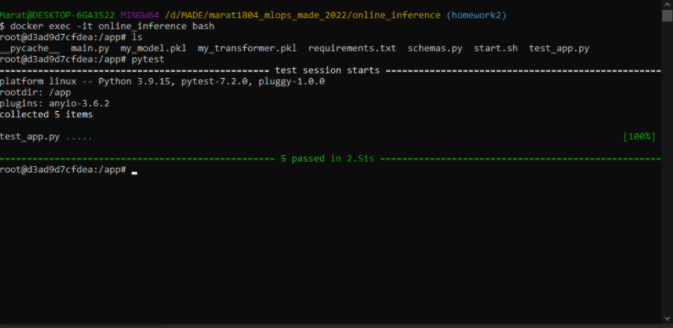

# Online inference project
### To build image
From source in this repository:
Working directory should be `online_inference/` and then run:
```
docker build -t marat1804/online_inference:v1 .
```

To pull from DockerHub - [my image](https://hub.docker.com/repository/docker/marat1804/online_inference):
```
docker pull marat1804/online_inference:v1
```

### To run container
```
docker run --name online_inference -p 8000:8000 marat1804/online_inference:v1
```
Now service is running on  the localhost at the port 8000

To check swagger go to `http://127.0.0.1:8000/docs`

### To test service with requests from `synthetic_data.csv`
Open new terminal, from `online_inference/` run:
```
python3 requests_to_server.py
```
### To run tests
```
docker exec -it online_inference bash
pytest
```

And the result is:


